# LAB 10 – Guide d'installation de Frida
 

## Objectifs pédagogiques
- Installer et vérifier Frida (client, Python et CLI) sur Windows, macOS et Linux.
- Déployer et lancer `frida-server` sur un appareil Android (et options iOS si pertinent).
- Établir une connexion et injecter un script minimal pour valider l'environnement.
- Diagnostiquer les problèmes courants d'installation.

## Prérequis
- Système d'exploitation : Windows, Linux ou macOS
- Python 3 installé
- Appareil Android rooté ou émulateur rooté
- ADB (Android Debug Bridge) configuré

---

## Déroulement du Lab

### Étape 1 – Installation du client Frida
Installation des outils Frida sur la machine hôte via Python (pip) et vérification de la version installée pour s'assurer du bon fonctionnement de la CLI (`frida --version`).
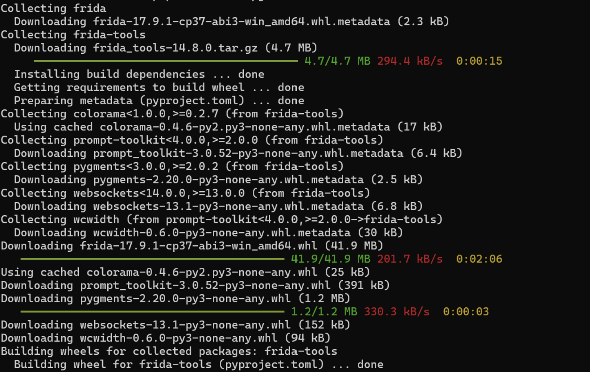
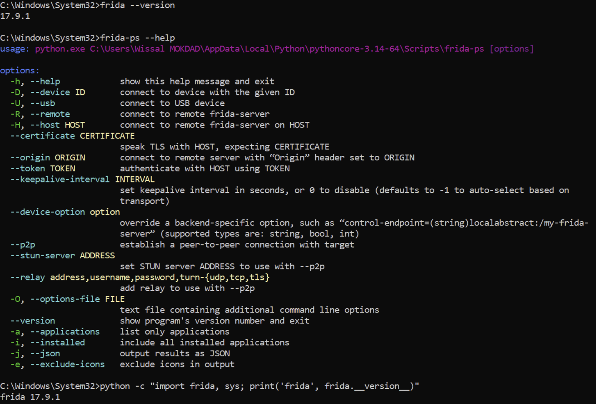

### Étape 2 – Installation des outils Android
Vérification de l'installation de `adb` et détection de l'appareil (émulateur ou smartphone physique) avec `adb devices`.
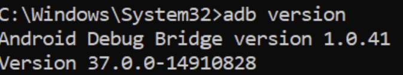
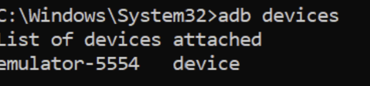

### Étape 3 – Récupérer et déployer frida-server
Identification de l'architecture CPU du device (ex: `x86_64` ou `arm64`) pour télécharger la bonne version du `frida-server`. Push du binaire dans `/data/local/tmp/`, attribution des droits d'exécution (`chmod +x`) et lancement en arrière-plan.
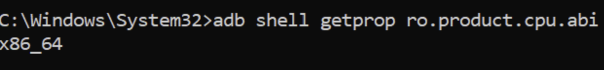
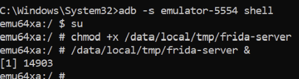

### Étape 4 – Test de connexion depuis le PC
Utilisation de la commande `frida-ps -U` et `frida-ps -Uai` pour lister les processus en cours d'exécution sur le périphérique USB/émulateur et confirmer que le PC communique bien avec le `frida-server`.
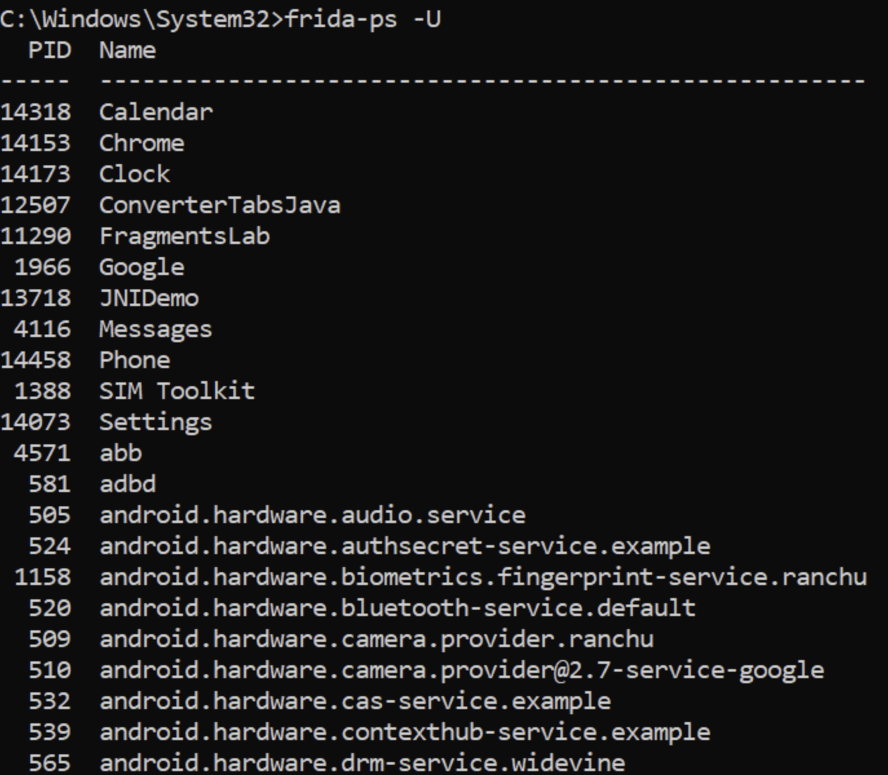
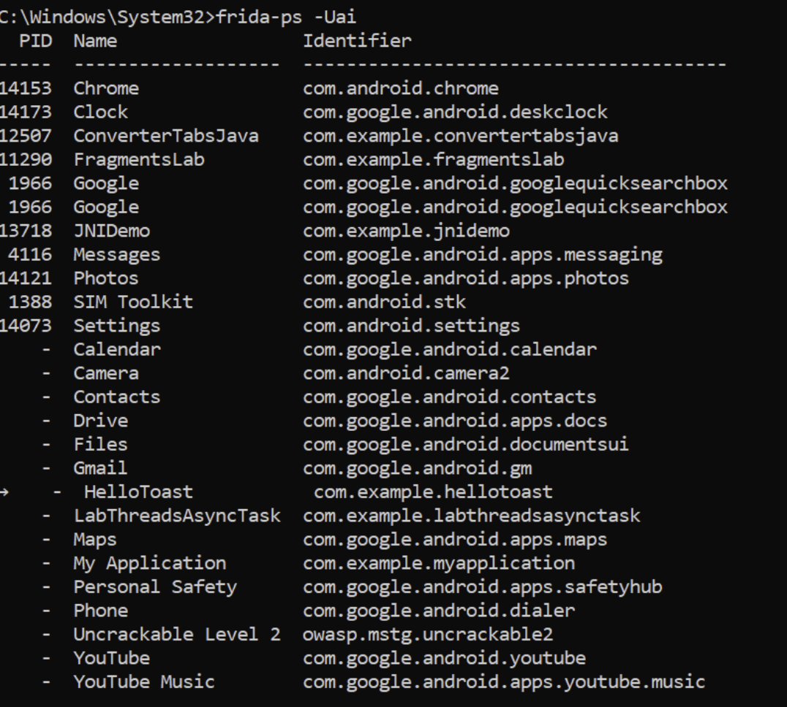

### Étape 5 – Injection minimale pour valider
Création d'un petit script JavaScript pour valider que le moteur Frida est capable de s'attacher à un processus et d'exécuter du code (`Java.perform`).
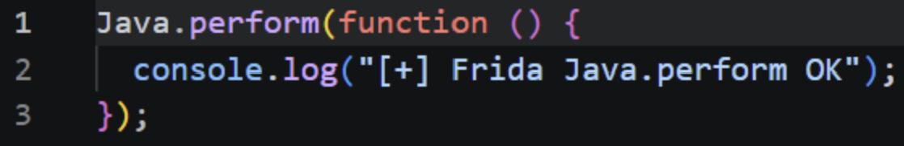

### Étape 6 – Explorer la console interactive Frida
Lancement de la console interactive Frida (REPL) et attachement à un processus cible pour commencer l'exploration de l'environnement Java/Android.
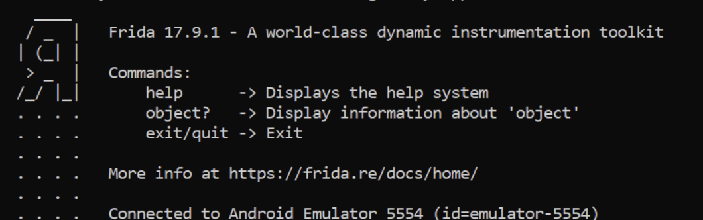

### Étape 7 et 8 – Observer les appels sensibles (Réseau, Fichiers, Crypto)
Utilisation de l'API `Interceptor` de Frida pour hooker des fonctions bas niveau de la `libc.so` telles que `connect`, `send`, `recv`, `open` et `read`. Cela permet de capturer les échanges réseau et l'accès au stockage local en temps réel.
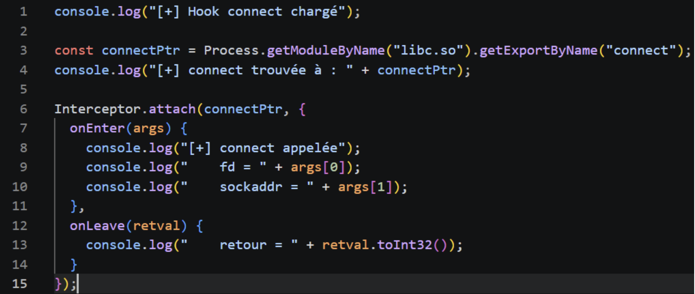
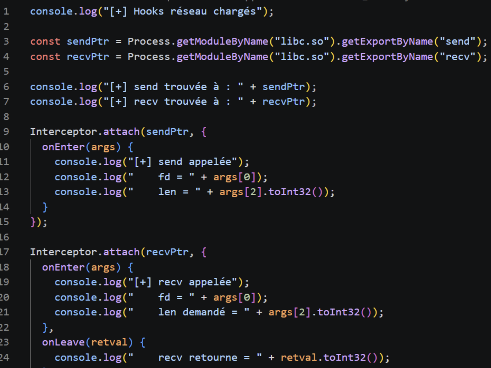
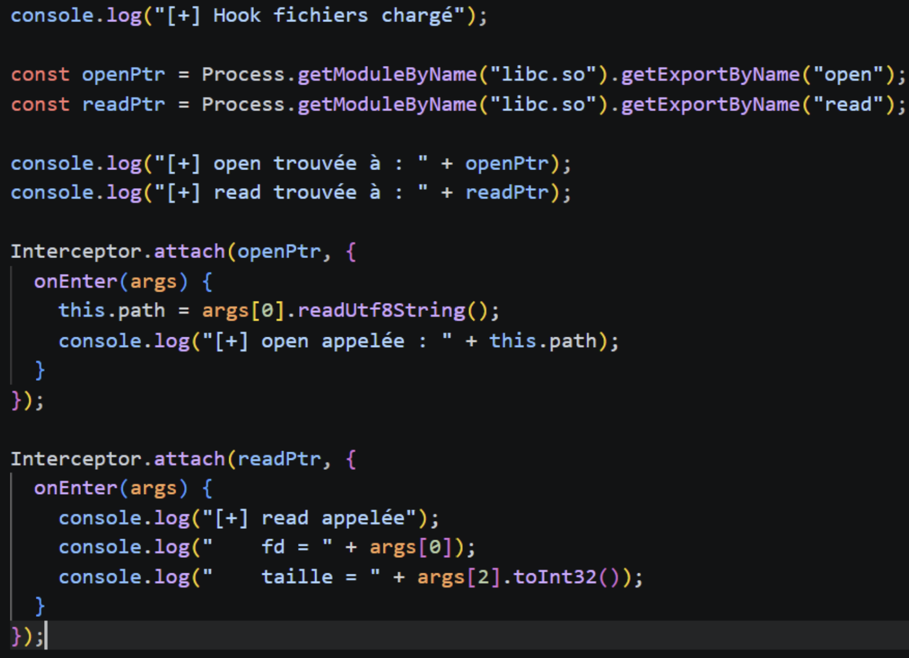

---

## Bonnes pratiques et sécurité
- Ne jamais déployer un `frida-server` sur un téléphone personnel principal, car il expose l'appareil à un accès root complet via le réseau local/USB.
- Toujours restreindre l'utilisation de Frida aux environnements de test (émulateurs, téléphones dédiés au pentest).
- Nettoyer l'appareil après utilisation (voir section Nettoyage).

## Nettoyage
Après l'audit, il est recommandé de stopper le serveur Frida et de supprimer le binaire de l'appareil Android :
```bash
adb shell "killall frida-server"
adb shell "rm /data/local/tmp/frida-server"
```

## Dépannage (FAQ)
- **Version Mismatch :** Assurez-vous que la version du client Frida (pip) et celle du `frida-server` sont **exactement identiques**.
- **Unable to connect :** Vérifiez que `frida-server` tourne bien en tâche de fond sur le téléphone (via `adb shell ps | grep frida`).
- **Permission Denied :** N'oubliez pas le `chmod +x` sur le binaire `frida-server`.

## Conclusion personnelle et difficultés rencontrées
L'installation de Frida est généralement fluide, mais nécessite de la rigueur, notamment sur l'alignement strict des versions entre le client Python et le serveur Android. La compréhension des hooks bas-niveau sur `libc.so` montre toute la puissance de Frida pour contourner les protections standards.

[Lien vers le dépôt GitHub](https://github.com/Oumaymaa659/LAB-10-Guide-d-installation-de-Frida)
